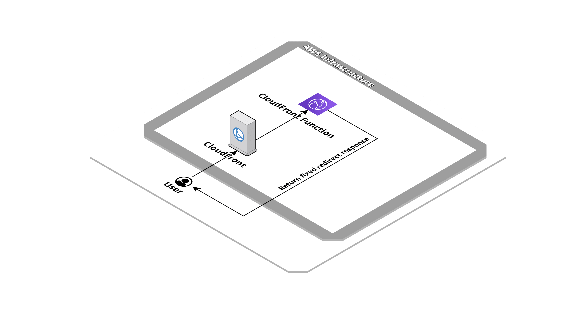

# Website Redirect


Simple website that redirect to a specific URL.

## Created resources

This application creates a CloudFront distribution that use CloudFront Function to return a fixed redirect response.



## Installation

| Region       | Deploy Link |
| ------------ | ----------- |
| eu-west-1    | [](https://eu-west-1.console.aws.amazon.com/cloudformation/home#/stacks/create/review?templateURL=https://bitbull-serverless-templates-butoamoogh8eigo.s3.eu-west-1.amazonaws.com/website-redirect/template.yml&stackName=website-redirect) |
| eu-central-1 | [](https://eu-central-1.console.aws.amazon.com/cloudformation/home#/stacks/create/review?templateURL=https://bitbull-serverless-templates-saijuozaeshae6e.s3.eu-central-1.amazonaws.com/website-redirect/template.yml&stackName=website-redirect) |
| us-east-1    | [](https://us-east-1.console.aws.amazon.com/cloudformation/home#/stacks/create/review?templateURL=https://bitbull-serverless-templates-chai7ephae5eet2.s3.us-east-1.amazonaws.com/website-redirect/template.yml&stackName=website-redirect) |
| us-east-2    | [](https://us-east-2.console.aws.amazon.com/cloudformation/home#/stacks/create/review?templateURL=https://bitbull-serverless-templates-xae9och1eipiem8.s3.us-east-2.amazonaws.com/website-redirect/template.yml&stackName=website-redirect) |


Using the [SAM CLI](https://docs.aws.amazon.com/serverless-application-model/latest/developerguide/what-is-sam.html):
```bash
sam build
sam deploy --guided
```

Including in an other SAM template:
```yaml
AWSTemplateFormatVersion: '2010-09-09'
Transform: AWS::Serverless-2016-10-31

Resources:
  WebsiteRedirect:
    Type: AWS::CloudFormation::Stack
    Properties:
      TemplateURL: # pick a templates links from section below, based on your region
      Parameters:
          RedirectStatusCode: "301", 
          RedirectStatusDescription: "Permanent Redirect", 
          RedirectUrl: "https://www.example.com/",
          AcmCertificateArn: "arn:aws:acm:us-east-1:000000000000:certificate/xxxxxxxxxxxxxxxxx", 
          CloudFrontAliases: "example.com,example1.com,www.example2.com", 
          CloudFrontPriceClass: "PriceClass_100"
```

## Public templates

| Region       | Template URLs                                                                                                    |
| ------------ | ---------------------------------------------------------------------------------------------------------------- |
| eu-west-1    | https://bitbull-serverless-templates-butoamoogh8eigo.s3.eu-west-1.amazonaws.com/website-redirect/template.yml    |
| eu-central-1 | https://bitbull-serverless-templates-saijuozaeshae6e.s3.eu-central-1.amazonaws.com/website-redirect/template.yml |
| us-east-1    | https://bitbull-serverless-templates-chai7ephae5eet2.s3.us-east-1.amazonaws.com/website-redirect/template.yml    |
| us-east-2    | https://bitbull-serverless-templates-xae9och1eipiem8.s3.us-east-2.amazonaws.com/website-redirect/template.yml    |

## Parameters

This application need some parameters when you deploy it:

- **RedirectStatusCode**: The redirect status code.

- **RedirectStatusDescription**: The redirect status description.

- **RedirectUrl**: The redirect URL.

- **AcmCertificateArn**: The certificate arn for the domain name provided.

- **CloudFrontAliases**: The endpoint aliases valid for provided certificate.

- **CloudFrontPriceClass**: The price class for CloudFront distribution.


## Outputs

- **CloudFrontDistribution**: The CloudFront distribution that return redirect response.

## Credits

- Repository badges by [Shields.io](https://shields.io/)
- Infrastructure schema by [Cloudcraft](https://www.cloudcraft.co/)
